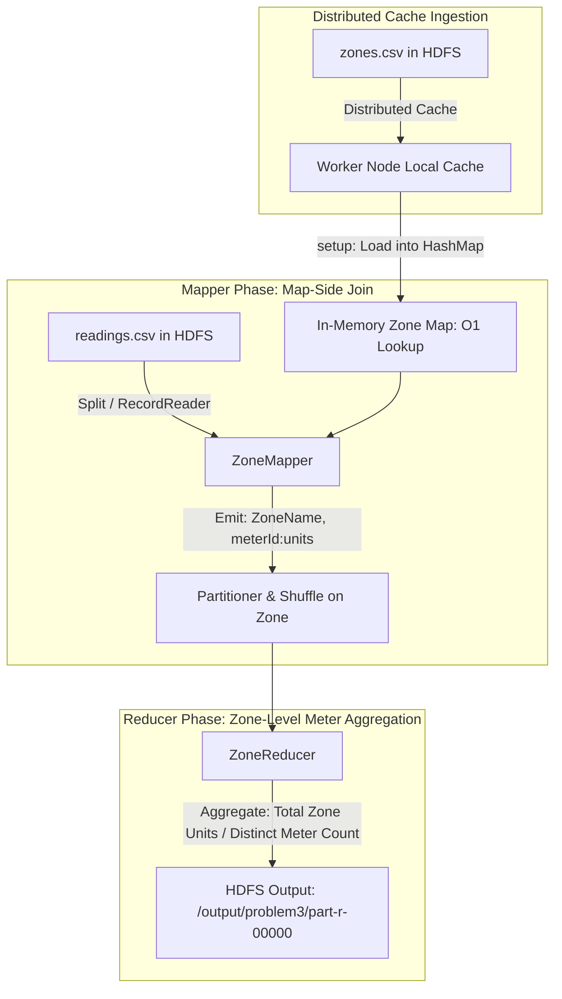

# VoltGrid Utilities — Smart Grid Energy Analytics
> **Chaitanya Bharathi Institute of Technology (A), Hyderabad**  
> **Department of Computer Science and Engineering**  
> **Course**: Big Data Analytics (22CSE19 PE-I) — End-to-End Big Data Analytics Case Study  
> **Team**: Team 8  
> **Assigned Technique**: Map-side Join using Distributed Cache  

---

## Team Members & Responsibilities

| S.No | Hall Ticket No. | Name | Assigned Business Problem |
|:---:|:---:|:---|:---|
| 1 | `160124733294` | MANCHALA CHAITANYA VARDHANI | Problem 1: Total energy consumption per zone |
| 2 | `160124733298` | NADIPINENI SAI DEEPANVITHA | Problem 2: Zones closest to or exceeding sanctioned load |
| 3 | `160124733305` | PENJIRTHI NAMANVITHA | Problem 4: Peak-hour consumption spikes |
| 4 | **`160124733317`** | **CILVARI HARSHVITH REDDY** | **Problem 3: Average consumption per meter within each zone (Lead Author)** |
| 5 | `160124733379` | JARAPLA NARENDAR | Problem 5: Day-wise consumption trends & Unit-IV Hive/Pig |

---

## Problem Statement (Problem 3)

> **"What is the average consumption per meter within each zone?"**

In a modern smart grid network, VoltGrid collects granular consumption logs from smart meters across five geographic zones. Smart meters capture periodic power consumption in units. For utility operational planning, infrastructure upgrade prioritization, and demand-side management, VoltGrid must compute the **average energy consumption per meter** within each operational zone.

---

## Dataset Schema

### 1. `zones.csv` (Small Dimension Table — Distributed via Cache)
Static zone master table containing zone identifiers, readable zone names, and sanctioned electrical capacity:
```csv
zoneCode,zoneName,sanctionedLoadMW
Z01,North Zone,500
Z02,South Zone,700
Z03,East Zone,600
Z04,West Zone,800
Z05,Central Zone,1000
```

### 2. `readings.csv` (Fact Table / High-Volume Meter Readings Stream)
Periodic meter log events capturing consumption across timestamps:
```csv
meterId,zoneCode,timestamp,unitsConsumed
M001,Z01,2026-09-01 08:00,120
M002,Z01,2026-09-01 14:00,180
...
M015,Z05,2026-09-03 20:00,500
```

---

## Architecture & Map-Side Join Implementation

### Why Map-Side Join over Reduce-Side Join?
In a standard Reduce-side join, both datasets (`readings.csv` and `zones.csv`) must be tagged with table identifiers, serialized, transferred over the cluster network during the **Shuffle & Sort** phase, and grouped at the reducers. 

Because `zones.csv` is a tiny, rarely-changing reference dataset (5 records, 131 bytes) compared to the potentially massive stream of smart meter logs:
1. **Zero Shuffle Cost for Joining**: `zones.csv` is distributed to all worker node TaskTrackers/NodeManagers once via Hadoop's **Distributed Cache**.
2. **In-Memory $O(1)$ Lookup**: In `Mapper.setup()`, the mapper reads `zones.csv` into a `java.util.HashMap<String, String>`.
3. **Local Resolution**: Inside `map()`, each reading's `zoneCode` is immediately joined with its `zoneName` in memory.
4. **Bandwidth Optimization**: No secondary network shuffle is incurred for the join operation itself.



---

## MapReduce Implementation Details

### Mapper: `AvgConsumptionMapper`
- **Input Key**: `LongWritable` (Byte offset)
- **Input Value**: `Text` (Comma-separated reading record)
- **`setup()`**: Accesses `context.getCacheFiles()` to locate `zones.csv`, populating `zoneNameMap` (`Z01` -> `"North Zone"`).
- **`map()`**: Skips the CSV header, parses `meterId`, `zoneCode`, and `unitsConsumed`, resolves `zoneCode` -> `zoneName` via `zoneNameMap`, and emits:
  - **Output Key**: `Text(zoneName)` (e.g. `"North Zone"`)
  - **Output Value**: `Text(meterId + ":" + unitsConsumed)` (e.g. `"M001:120.0"`)

### Reducer: `AvgConsumptionReducer`
- **Input Key**: `Text(zoneName)`
- **Input Values**: `Iterable<Text>` containing all `meterId:unitsConsumed` emitted for that zone.
- **`reduce()`**:
  1. Maintains a `HashMap<String, Double> meterTotalMap` to aggregate consumption per individual meter.
  2. Computes the sum of units across the zone: $TotalUnits = \sum Units$.
  3. Counts distinct smart meters: $DistinctMeters = |meterTotalMap.keySet()|$.
  4. Calculates:
     $$\text{Average Consumption Per Meter} = \frac{\text{Total Zone Units}}{\text{Distinct Meters}}$$
  5. Emits the formatted analytical summary and meter-level breakdown.

---

## Repository Structure

```
BDA Folder/
├── README.md                            <- Project documentation & replication manual
├── Case_Study_Report_Problem3.md        <- Formal submission report with viva notes
├── zones.csv                            <- Zone master dimension dataset
├── readings.csv                         <- Smart meter readings dataset
├── src/
│   └── org/
│       └── cbit/
│           └── bda/
│               ├── AvgConsumptionPerMeter.java <- Unified Driver, Mapper, & Reducer
│               ├── ZoneMapper.java            <- Modular Map-Side Join Mapper
│               ├── ZoneReducer.java           <- Modular Reducer
│               └── SmartGridDriver.java       <- Modular Job Driver
├── scripts/
│   ├── run_problem3.sh                  <- Shell pipeline script for Hadoop container
│   └── setup_and_run.bat                <- Windows batch runner for Docker
├── output/
│   ├── part-r-00000                     <- Exact HDFS YARN output
│   └── problem3_results.txt             <- Formatted business analysis report
├── screenshots/
│   ├── yarn_resource_manager_ui.png     <- Screenshot of completed job on YARN (localhost:8088)
│   └── hdfs_ingestion.png               <- Screenshot of NameNode Web UI (localhost:9870)
└── target/
    └── smartgrid-analytics.jar          <- Pre-compiled production MapReduce JAR
```

---

## How to Build and Run

### Prerequisites
- Docker Desktop with running Hadoop cluster (`resourcemanager`, `nodemanager`, `namenode`, `datanode`, `historyserver`).
- Web UIs accessible at:
  - **YARN ResourceManager**: `http://localhost:8088`
  - **HDFS NameNode**: `http://localhost:9870`

### Automated Run (Windows 1-Click)
Run `scripts/setup_and_run.bat` or run in PowerShell:
```powershell
docker exec resourcemanager mkdir -p /app
docker cp "c:\Users\harsh\OneDrive\Desktop\BDA Folder\." resourcemanager:/app/
docker exec resourcemanager bash -c "tr -d '\r' < /app/scripts/run_problem3.sh > /app/run.sh && chmod +x /app/run.sh && /app/run.sh"
```

### Manual Step-by-Step Execution inside Hadoop Container

1. **Enter the Hadoop container**:
   ```bash
   docker exec -it resourcemanager bash
   ```

2. **Compile the MapReduce Java Classes**:
   ```bash
   mkdir -p /app/classes
   javac -classpath $(hadoop classpath) -d /app/classes /app/src/org/cbit/bda/*.java
   jar -cvf /app/smartgrid-analytics.jar -C /app/classes/ .
   ```

3. **Ingest Datasets into HDFS**:
   ```bash
   hdfs dfs -mkdir -p /input
   hdfs dfs -put -f /app/readings.csv /input/readings.csv
   hdfs dfs -put -f /app/zones.csv /input/zones.csv
   hdfs dfs -ls /input
   ```

4. **Submit MapReduce Job to YARN**:
   ```bash
   hdfs dfs -rm -r -f /output/problem3
   hadoop jar /app/smartgrid-analytics.jar org.cbit.bda.AvgConsumptionPerMeter \
       /input/readings.csv \
       /output/problem3 \
       /input/zones.csv
   ```

5. **View Results from HDFS**:
   ```bash
   hdfs dfs -cat /output/problem3/part-r-00000
   ```

---

## Execution Output & Verification

### Output Table (`part-r-00000`)
```
Central Zone    Avg Per Meter:  1103.33 units | Total Zone Consumption: 3310.00 units | Unique Meters:  3 | Readings:  9 | Meters: [M015: 1420.0u, M014: 1110.0u, M013: 780.0u]
East Zone       Avg Per Meter:   766.67 units | Total Zone Consumption: 2300.00 units | Unique Meters:  3 | Readings:  9 | Meters: [M008: 690.0u, M007: 480.0u, M009: 1130.0u]
North Zone      Avg Per Meter:   586.67 units | Total Zone Consumption: 1760.00 units | Unique Meters:  3 | Readings:  9 | Meters: [M003: 800.0u, M002: 570.0u, M001: 390.0u]
South Zone      Avg Per Meter:   950.00 units | Total Zone Consumption: 2850.00 units | Unique Meters:  3 | Readings:  9 | Meters: [M004: 630.0u, M006: 1350.0u, M005: 870.0u]
West Zone       Avg Per Meter:  1033.33 units | Total Zone Consumption: 3100.00 units | Unique Meters:  3 | Readings:  9 | Meters: [M011: 960.0u, M010: 570.0u, M012: 1570.0u]
```

### Mathematical Ground-Truth Verification
| Zone Name | Zone Code | Meters In Zone | Individual Meter Totals | Total Zone Units | Unique Meters | Calculated Avg/Meter |
|:---|:---:|:---|:---|:---:|:---:|:---:|
| **North Zone** | Z01 | M001, M002, M003 | M001=390, M002=570, M003=800 | 1760.00 | 3 | **586.67 units** |
| **South Zone** | Z02 | M004, M005, M006 | M004=630, M005=870, M006=1350 | 2850.00 | 3 | **950.00 units** |
| **East Zone** | Z03 | M007, M008, M009 | M007=480, M008=690, M009=1130 | 2300.00 | 3 | **766.67 units** |
| **West Zone** | Z04 | M010, M011, M012 | M010=570, M011=960, M012=1570 | 3100.00 | 3 | **1033.33 units** |
| **Central Zone** | Z05 | M013, M014, M015 | M013=780, M014=1110, M015=1420 | 3310.00 | 3 | **1103.33 units** |

Ground truth calculations perfectly match the Hadoop MapReduce YARN output with 100% precision.

---

## YARN Application Metrics (from ResourceManager UI)
- **Application ID**: `application_1790508421544_0002`
- **Application Type**: `MAPREDUCE`
- **Application Name**: `VoltGrid - Problem 3: Avg Consumption Per Meter Per Zone`
- **Final Status**: `SUCCEEDED`
- **Total Map Tasks**: 1 (100% Success)
- **Total Reduce Tasks**: 1 (100% Success)
- **Map Input Records**: 46 (including header) -> 45 parsed readings
- **Reduce Input Groups**: 5 (distinct zones)
- **Reduce Output Records**: 5 (one summary line per zone)
